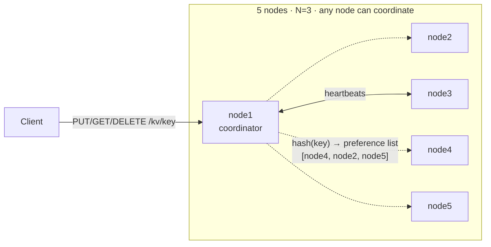

# DistribuKV

[](https://github.com/prabuddh148/distribukv/actions/workflows/ci.yml)

A small, working distributed key-value store in the style of Amazon Dynamo / Cassandra, written in Java 21 + Spring Boot.

It partitions keys across nodes with **consistent hashing**, replicates every key to **N = 3** nodes, and lets the client choose **STRONG** (majority quorum) or **EVENTUAL** consistency per request. It keeps serving when nodes crash or get partitioned off, thanks to a **heartbeat failure detector**, **hinted handoff** and **read repair**. Each node writes to an append-only **commit log** on disk.

~1,300 lines of main code. Every design choice below is intentional and deliberately small enough to explain line by line.

---

## Architecture



Inside each node:

```
 HTTP /kv ──▶ Coordinator ──┬──▶ ConsistentHashRing   (which 3 nodes own this key?)
                            ├──▶ StorageEngine        (local replica: map + commit.log)
                            ├──▶ NodeClient ─────────▶ peers' /internal/kv (parallel, async)
                            └──▶ HintedHandoff        (writes a replica missed, replayed later)
              Membership ◀── heartbeats every 500 ms, DOWN after 2 s of silence
```

| Package | Responsibility |
|---|---|
| [`ring`](src/main/java/io/distribukv/ring/ConsistentHashRing.java) | Consistent hash ring, 256 virtual nodes per node, MD5 → 64-bit tokens, preference lists |
| [`coordinator`](src/main/java/io/distribukv/coordinator/Coordinator.java) | Fan-out reads/writes, quorum counting, read repair, request metrics |
| [`storage`](src/main/java/io/distribukv/storage/StorageEngine.java) | Last-write-wins versions, tombstones, append-only commit log with replay + compaction |
| [`cluster`](src/main/java/io/distribukv/cluster) | Failure detector, hinted handoff, node-to-node HTTP client, fault injection |
| [`api`](src/main/java/io/distribukv/api) | Client API, internal replica API, cluster introspection |

### Write path (`PUT /kv/user:42?consistency=STRONG`)
1. Any node receives the request and becomes the **coordinator**.
2. It stamps a version `(timestamp from a hybrid logical clock, nodeId)`.
3. It hashes the key onto the ring and takes the next **3 distinct nodes** clockwise.
4. It sends the write to all 3 **in parallel**. Replicas the failure detector marks DOWN are skipped right away (no waiting for a timeout).
5. It answers as soon as **W** replicas acknowledge: W = 2 for STRONG, W = 1 for EVENTUAL.
6. Any replica that failed or was skipped gets a **hint**. The coordinator replays it once that replica is UP again.

### Read path
Query all 3 replicas, return once **R** respond (R = 2 STRONG / 1 EVENTUAL), pick the newest version. After every replica has answered, push that newest version to any replica holding an older one (**read repair**).

---

## Design decisions & trade-offs

| Decision | Why | Cost / what I'd change at scale |
|---|---|---|
| **Consistent hashing with virtual nodes** instead of `hash % N` or range partitioning | Adding a 5th node to 4 moves ~20% of keys, versus ~80% with modulo (proved in [`ConsistentHashRingTest`](src/test/java/io/distribukv/ring/ConsistentHashRingTest.java)). Virtual nodes smooth out load. I measured the spread at 150 vs 256 vnodes (16–26% vs 18.5–21.6% of keys per node) and picked 256. | Range partitioning would allow range scans; hashing gives up ordering in exchange for even load with no hot-spot tuning. |
| **Leaderless quorum replication** (Dynamo) instead of a leader per shard (Raft) | No election and no failover pause: any 2 of 3 replicas can serve a STRONG request. It also makes consistency a per-request knob. | Concurrent writes to one key are resolved by timestamp, not by a log order. For linearizable operations (compare-and-set) I would switch to Raft per shard. |
| **R + W > N** for STRONG (2 + 2 > 3) | Every read quorum overlaps the latest successful write quorum, so a read never misses an acknowledged write (without concurrent writes or skew). | Needs a majority of replicas up. The chaos test shows STRONG returning `503` when 2 of 3 are down while EVENTUAL keeps working. That's CAP in practice: under partition, STRONG picks C, EVENTUAL picks A. |
| **Last-write-wins + hybrid logical clock** | Simple and deterministic, and no sibling values for clients to reconcile. The clock never goes backwards and moves past any timestamp it sees from a peer. | Clock skew can drop a concurrent write. Vector clocks or CRDTs would detect concurrent writes instead of silently discarding one. |
| **Hinted handoff + read repair** instead of Merkle-tree anti-entropy | Covers the common cases (short outages, stale replicas that get read) in very little code. | Hints are kept in memory, so they're lost if the coordinator itself crashes. A cold key on a replica that missed writes only heals once it's read. Merkle-tree sync would close that gap. |
| **Strict quorum** (hints do not count toward W) | A `200` for STRONG really means 2 of the key's own replicas stored the write. | Dynamo's *sloppy* quorum would accept more writes during failures but weaken the guarantee. |
| **Append-only commit log per node** instead of MySQL | This is the core idea behind a WAL/LSM store: sequential appends, replay on boot, compaction. It also means no external database to run. Order doesn't matter on replay because LWW is idempotent, and a torn last line is skipped. | Everything is held in memory. A real engine would add an LSM tree / SSTables. `KV_FSYNC=true` (on in Kubernetes) trades throughput for durability. |
| **Node-to-node HTTP** instead of Kafka for replication | Replicas are written synchronously, so the coordinator can actually count acknowledgements. A Kafka log would add a broker hop and make quorum acks indirect. | A replication log becomes worthwhile for change-data-capture or cross-region async replication. |
| **Static membership** | Keeps the project focused on replication and failure handling. | Dynamic join/leave (gossip plus streaming data to new owners) is the next step. The ring already supports `addNode` / `removeNode`. |

**Known limitation, stated honestly:** a STRONG write that fails with `503` is **not rolled back**. The replica that did accept it keeps it, and hints spread it later. That is standard Dynamo/Cassandra behaviour: clients should treat `503` as "unknown outcome" and retry, which is safe because writes are idempotent.

---

## Failure scenarios tested

Every scenario runs automatically in three places:
1. [`ClusterIntegrationTest`](src/test/java/io/distribukv/ClusterIntegrationTest.java): a real 4-node cluster started inside JUnit, talking over HTTP
2. [`scripts/chaos-test.sh`](scripts/chaos-test.sh): 5 separate processes locally, or 5 containers in CI (Docker Compose)
3. [`scripts/k8s-smoke-test.sh`](scripts/k8s-smoke-test.sh): a replica pod is deleted in a Kubernetes cluster in CI

| Scenario | Expected | Result |
|---|---|---|
| Kill 1 of a key's 3 replicas | STRONG reads and writes keep succeeding (2/3) | ✅ `200` |
| Kill 2 of 3 replicas | STRONG write rejected, EVENTUAL write/read accepted | ✅ `503` / `200` |
| Restart the killed replicas | They receive the writes they missed via hinted handoff | ✅ converged in ~6 s (includes JVM startup) |
| Isolate a replica (simulated network partition) | Isolated node refuses traffic; cluster routes around it; it catches up after healing | ✅ converged ~1 s after healing |
| Replica holds a stale version | A STRONG read returns the newest value and repairs the stale replica | ✅ |
| Restart a node | Data is recovered from its commit log before any peer resends it | ✅ |
| Delete a key | Tombstone wins everywhere; `404` from every node | ✅ |

Real output from a local 5-process run:

```
[  4s] key chaos:1789295309 -> replicas node2 node4 node5, coordinator node1
[  4s] --- scenario 1: one replica crashes
[  4s] ok  - strong PUT v1 (HTTP 200)
[  5s] killed node2
[  5s] ok  - strong GET with 2/3 replicas (HTTP 200)
[  5s] ok  - strong PUT v2 with 2/3 replicas (HTTP 200)
[  5s] --- scenario 2: quorum lost (two replicas down)
[  6s] killed node4
[  6s] ok  - strong PUT rejected without quorum (HTTP 503)
[  6s] ok  - eventual PUT accepted with 1/3 replicas (HTTP 200)
[  6s] ok  - eventual GET with 1/3 replicas (HTTP 200)
[  6s] --- scenario 3: recovery via hinted handoff
[  6s] restarted node2
[  7s] restarted node4
[ 13s] ok  - node2 converged to 'v3'
[ 13s] ok  - node4 converged to 'v3'
[ 13s] --- scenario 4: network partition around a replica
[ 13s] ok  - isolate node5 (HTTP 200)
[ 14s] ok  - isolated node refuses traffic (HTTP 503)
[ 14s] ok  - strong PUT during partition (HTTP 200)
[ 14s] ok  - heal node5 (HTTP 200)
[ 15s] ok  - node5 converged to 'v4'
[ 15s] ALL FAILURE SCENARIOS PASSED
```

---

## Benchmarks

[`bench/Bench.java`](bench/Bench.java): 5 nodes as local processes on one Windows laptop, 5,000 operations per row, 32 concurrent clients spread round-robin over all nodes, 100-byte values, no fsync.

| Consistency | Op  | Throughput (ops/s) | p50 (ms) | p95 (ms) | p99 (ms) | Errors |
|-------------|-----|-------------------:|---------:|---------:|---------:|-------:|
| STRONG      | PUT |                597 |    39.91 |   139.93 |   303.98 |      0 |
| STRONG      | GET |                744 |    30.63 |   113.53 |   197.95 |      0 |
| EVENTUAL    | PUT |                981 |    20.56 |    97.27 |   180.15 |      0 |
| EVENTUAL    | GET |               1896 |     9.53 |    57.21 |   111.35 |      0 |

**Reading the numbers:** EVENTUAL writes are ~1.6× faster and EVENTUAL reads ~2.5× faster than STRONG, because the coordinator returns after the first replica (often itself) instead of waiting for a second one over the network. Tail latency is dominated by the slowest replica in the quorum. All 5 JVMs share one laptop's CPU with the load generator, so the absolute numbers are a floor, not a ceiling; the ratio between the modes is the meaningful part.

---

## Run it

### Locally, no Docker (Java 21+)
```bash
scripts/cluster.sh start          # builds, then starts node1..node5 on ports 8081-8085
open http://localhost:8081         # live dashboard
scripts/chaos-test.sh local       # run the failure scenarios
java bench/Bench.java             # benchmark
scripts/cluster.sh stop
```
On Windows, run the scripts from Git Bash.

### Docker Compose
```bash
docker compose up -d --build
scripts/chaos-test.sh compose
docker compose down -v
```

### Kubernetes
```bash
kubectl apply -f k8s/distribukv.yaml
kubectl -n distribukv rollout status statefulset/distribukv
kubectl -n distribukv port-forward svc/distribukv-client 8080:80
```
Each node is a pod in a `StatefulSet`, giving it a stable identity (`distribukv-0 … distribukv-4`, which is what the ring hashes) and its own `PersistentVolume` for the commit log. A headless service gives every pod a DNS name for peer traffic, and `distribukv-client` load-balances client requests to any node. The image is published to `ghcr.io/prabuddh148/distribukv`.

### CI/CD ([`.github/workflows/ci.yml`](.github/workflows/ci.yml))
On every push: **build + unit/integration tests** → in parallel, **chaos tests on a 5-container Docker Compose cluster** and **deploy to a real Kubernetes cluster (kind) + pod-kill smoke test** → **publish the image to GHCR** (main only).

---

## API

```bash
# Write (default consistency is STRONG)
curl -X PUT -H 'Content-Type: text/plain' --data-raw 'alice' 'localhost:8081/kv/user:42?consistency=STRONG'
{"key":"user:42","version":1789295232583,"consistency":"STRONG","coordinator":"node1",
 "replicas":["node5","node2","node3"],"acknowledgedBy":["node3","node2"],"requiredAcks":2}

# Read from any node
curl 'localhost:8085/kv/user:42?consistency=EVENTUAL'
curl -X DELETE 'localhost:8081/kv/user:42'
```

| Endpoint | Purpose |
|---|---|
| `PUT/GET/DELETE /kv/{key}?consistency=STRONG\|EVENTUAL` | Client API. `404` if missing, `503` if quorum not reached, `400` for invalid keys (`[A-Za-z0-9._:-]{1,256}`) |
| `GET /cluster/status` | Failure-detector view, ring ownership, keys and pending hints per node |
| `GET /cluster/ring?key=…` | Which replicas own a key |
| `POST /cluster/nodes/{id}/isolate?enabled=true\|false` | Simulate / heal a network partition around a node |
| `GET /actuator/prometheus` | Metrics |
| `/internal/kv/{key}`, `/internal/ping` | Node-to-node only |

### Observability
Micrometer metrics at `/actuator/prometheus`, including:
- `kv_requests_seconds{op,consistency,outcome}`: request latency histogram, p50/p95/p99
- `kv_replication_ack_latency_seconds`: how long remote replicas take to acknowledge a write
- `kv_hints_pending`, `kv_hints_stored_total`, `kv_hints_delivered_total`: hinted-handoff backlog
- `kv_read_repairs_total`, `kv_cluster_nodes_up`

Set `SPRING_PROFILES_ACTIVE=json` (as in Kubernetes) for structured ECS JSON logs.

### Configuration (env vars)
| Variable | Default | Meaning |
|---|---|---|
| `KV_NODE_ID` | `node1` | This node's id; must appear in `KV_CLUSTER` |
| `KV_CLUSTER` | – | `id=url,id=url,…` full membership |
| `KV_REPLICATION_FACTOR` | `3` | N |
| `KV_DEFAULT_CONSISTENCY` | `STRONG` | Used when a request doesn't specify one |
| `KV_VIRTUAL_NODES` | `256` | Tokens per node on the ring |
| `KV_FSYNC` | `false` | `fsync` the commit log on every write |
| `KV_HEARTBEAT_INTERVAL_MS` / `KV_FAILURE_TIMEOUT_MS` | `500` / `2000` | Failure detector tuning |
| `KV_REQUEST_TIMEOUT_MS` | `1000` | Per-replica request timeout |
| `KV_CHAOS_ENABLED` | `true` | Allow the isolate endpoint |

---

## What I'd build next
1. **Dynamic membership**: gossip-based join/leave, streaming the moved key ranges to new owners.
2. **Merkle-tree anti-entropy** to repair cold keys that are never read.
3. **Vector clocks** to detect concurrent writes instead of last-write-wins.
4. **Durable hints** and **tombstone garbage collection** (gc_grace, as in Cassandra).
5. **LSM storage** (memtable + SSTables + bloom filters) so data can exceed memory.
