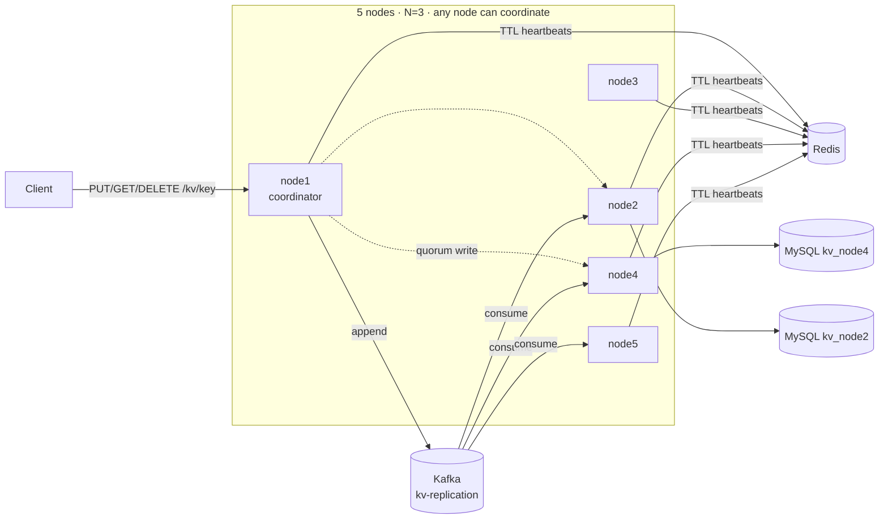

# DistribuKV

[](https://github.com/prabuddh148/distribukv/actions/workflows/ci.yml)

A small, working distributed key-value store in the style of Amazon Dynamo / Cassandra, written in Java 21 + Spring Boot, with **Kafka**, **MySQL** and **Redis** as optional infrastructure adapters.

It partitions keys across nodes with **consistent hashing**, replicates every key to **N = 3** nodes, and lets the client choose **STRONG** (majority quorum) or **EVENTUAL** consistency per request. It keeps serving when nodes crash or get partitioned off, thanks to **failure detection**, **hinted handoff**, **read repair** and a **Kafka replication log**.

| Concern | Self-contained mode (no infra) | Full-stack mode |
|---|---|---|
| Per-node storage | Append-only commit log on disk | **MySQL**, one database per node |
| Replication | Direct node-to-node quorum writes + hinted handoff | Same, plus a durable **Kafka** replication log that replicas consume |
| Failure detection | HTTP heartbeats between nodes | **Redis** TTL heartbeat keys, with automatic HTTP fallback |

The core algorithms do not depend on the infrastructure: every adapter is switched on by a `kv.*` flag, so the same jar runs a laptop cluster with zero dependencies or the full stack in Docker Compose / Kubernetes.

---

## Architecture



Inside each node:

```
 HTTP /kv ──▶ Coordinator ──┬──▶ ConsistentHashRing   (which 3 nodes own this key?)
                            ├──▶ StorageEngine        (commit log  |  MySQL database kv_<node>)
                            ├──▶ NodeClient ─────────▶ peers' /internal/kv (parallel, async)
                            ├──▶ ReplicationLog ─────▶ Kafka topic kv-replication (keyed by data key)
                            └──▶ HintedHandoff        (writes a replica missed, replayed later)
     ReplicationLogConsumer ◀── Kafka (consumer group per node, applies keys this node owns)
                 Membership ◀── Redis TTL heartbeats  (fallback: HTTP pings)
```

| Package | Responsibility |
|---|---|
| [`ring`](src/main/java/io/distribukv/ring/ConsistentHashRing.java) | Consistent hash ring, 256 virtual nodes per node, MD5 → 64-bit tokens, preference lists |
| [`coordinator`](src/main/java/io/distribukv/coordinator/Coordinator.java) | Fan-out reads/writes, quorum counting, Kafka-backed EVENTUAL writes, read repair, request metrics |
| [`storage`](src/main/java/io/distribukv/storage) | `StorageEngine` interface with [`CommitLogStorage`](src/main/java/io/distribukv/storage/CommitLogStorage.java) and [`MySqlStorage`](src/main/java/io/distribukv/storage/MySqlStorage.java); last-write-wins versions, tombstones |
| [`replication`](src/main/java/io/distribukv/replication) | Kafka producer ([`KafkaReplicationLog`](src/main/java/io/distribukv/replication/KafkaReplicationLog.java)) and consumer ([`ReplicationLogConsumer`](src/main/java/io/distribukv/replication/ReplicationLogConsumer.java)) |
| [`cluster`](src/main/java/io/distribukv/cluster) | [`Membership`](src/main/java/io/distribukv/cluster/Membership.java) + [`RedisLiveness`](src/main/java/io/distribukv/cluster/RedisLiveness.java), hinted handoff, node-to-node HTTP client, fault injection |
| [`api`](src/main/java/io/distribukv/api) | Client API, internal replica API, cluster introspection, public demo guard |

### Write path

**STRONG** (`PUT /kv/user:42?consistency=STRONG`)
1. Any node receives the request and becomes the **coordinator**.
2. It stamps a version `(hybrid logical clock timestamp, nodeId)`.
3. It hashes the key onto the ring and takes the next **3 distinct nodes** clockwise.
4. It writes to all 3 **in parallel**. Replicas the failure detector marks DOWN are skipped immediately.
5. It answers once **2 of 3** acknowledge. Replicas that missed the write get a **hint**, and the write is also appended to **Kafka** as a durable backstop.

**EVENTUAL, with Kafka** (`?consistency=EVENTUAL`)
1. The coordinator appends the write to the `kv-replication` topic (`acks=all`, idempotent producer, keyed by the data key so all versions of a key stay ordered in one partition).
2. As soon as Kafka confirms, it answers `200` with the log position, e.g. `"replicationLog": "kafka:kv-replication/5@0"`.
3. It also pushes the write to the replicas directly (best effort, for low replication lag).
4. Every node consumes the topic in its own consumer group and applies writes for keys it owns. Offsets are committed after applying, so **a replica that was down catches up from the log, even if the coordinator crashed and its in-memory hints are gone**. That case is tested in [`InfrastructureIntegrationTest`](src/test/java/io/distribukv/InfrastructureIntegrationTest.java).
5. If Kafka is unavailable, EVENTUAL degrades to a direct W=1 write instead of failing.

### Read path
Query all 3 replicas and return once **R** respond (R = 2 STRONG / 1 EVENTUAL), picking the newest version. After every replica has answered, push that version to any replica holding an older one (**read repair**).

---

## Design decisions & trade-offs

| Decision | Why | Cost / what I'd change at scale |
|---|---|---|
| **Consistent hashing with virtual nodes** instead of `hash % N` or range partitioning | Adding a 5th node to 4 moves ~20% of keys, versus ~80% with modulo (proved in [`ConsistentHashRingTest`](src/test/java/io/distribukv/ring/ConsistentHashRingTest.java)). I measured the spread at 150 vs 256 vnodes (16–26% vs 18.5–21.6% of keys per node) and picked 256. | Range partitioning would allow range scans; hashing trades ordering for even load. |
| **Leaderless quorum replication** (Dynamo) instead of a leader per shard (Raft) | No election and no failover pause: any 2 of 3 replicas can serve a STRONG request, and consistency becomes a per-request knob. | Concurrent writes to one key are resolved by timestamp. For linearizable operations (compare-and-set) I would use Raft per shard. |
| **R + W > N** for STRONG (2 + 2 > 3) | Every read quorum overlaps the latest successful write quorum. | Needs a majority of replicas. With 2 of 3 down, STRONG returns `503` while EVENTUAL keeps working: CAP in practice. |
| **Kafka as the replication log, but not on the STRONG ack path** | A STRONG write's guarantee is "2 replicas stored it", which needs synchronous replica acks; an async log would make the ack indirect. For EVENTUAL, the log *is* the durability guarantee: acking on Kafka means an acknowledged write survives the coordinator crashing and replicas being down for hours. Keying by data key keeps per-key order. | Kafka becomes a dependency for EVENTUAL durability; if it is down, EVENTUAL falls back to direct replication with in-memory hints. With delete-based retention, a replica down longer than retention would need a full resync (Merkle trees / snapshot). |
| **Consumer group per node + static membership** | Every node must see every write, so each node is its own group. `group.instance.id` lets a restarted node reclaim its partitions without waiting for a rebalance. | Each node reads all partitions and filters to keys it owns. At scale, map ring ranges to partitions so nodes only consume what they own. |
| **MySQL as per-node storage, one database per node** | Each node's database plays the role of its local disk, so replication and consistency stay in the KV layer, as in Cassandra/Dynamo. Last-write-wins is enforced **inside MySQL** with a conditional `UPDATE ... WHERE ts < ?` plus `INSERT`-on-miss, so concurrent writes from a coordinator, a hint and the Kafka consumer can never regress a version. | A shared MySQL server is a demo shortcut; in production each node gets its own instance (or RDS). A dedicated LSM engine (RocksDB) would be faster for pure KV. |
| **Redis TTL heartbeats** for failure detection, **HTTP fallback** | One `MGET` tells a node the liveness of the whole cluster instead of N pings, and a crashed node's key simply expires. If Redis is unreachable, nodes fall back to HTTP pings, so Redis is **not a single point of failure**. | A node can reach Redis but not its peers (asymmetric partition). Production systems combine this with direct probes (SWIM/gossip, as Cassandra does). |
| **Last-write-wins + hybrid logical clock** | Simple, deterministic; the clock never goes backwards and moves past any timestamp it sees. | Clock skew can drop a concurrent write. Vector clocks / CRDTs would detect concurrency. |
| **Hinted handoff + read repair + Kafka log** | Hints give ~1 s recovery for short outages; the Kafka log guarantees delivery for long ones; read repair fixes stale copies that get read. | Hints are in memory (the Kafka log covers their loss). Cold keys that miss the log's retention window would need Merkle-tree anti-entropy. |
| **Strict quorum** (hints do not count toward W) | A `200` for STRONG really means 2 of the key's own replicas stored the write. | Dynamo's *sloppy* quorum accepts more writes during failures but weakens the guarantee. |
| **Static membership** | Keeps the project focused on replication and failure handling. | Dynamic join/leave with range streaming is the next step; the ring already supports `addNode` / `removeNode`. |

**Known limitation, stated honestly:** a STRONG write that fails with `503` is **not rolled back**. The replica that accepted it keeps it, and hints and the log spread it later. That is standard Dynamo/Cassandra behaviour: clients should treat `503` as "unknown outcome" and retry, which is safe because writes are idempotent.

---

## Failure scenarios tested

| Where | Stack | What runs |
|---|---|---|
| [`ClusterIntegrationTest`](src/test/java/io/distribukv/ClusterIntegrationTest.java) | self-contained | 4-node cluster inside JUnit: crash, quorum loss, hints, read repair, partition, commit-log recovery, deletes |
| [`InfrastructureIntegrationTest`](src/test/java/io/distribukv/InfrastructureIntegrationTest.java) | real Kafka, MySQL, Redis (Testcontainers) | per-node MySQL rows, Kafka catch-up after coordinator loss, Redis failure detection |
| [`scripts/chaos-test.sh`](scripts/chaos-test.sh) | 5 processes locally, or 5 containers + Kafka/MySQL/Redis in CI | kill replicas, lose quorum, restart, partition, then inspect MySQL rows and Kafka consumer offsets |
| [`scripts/k8s-smoke-test.sh`](scripts/k8s-smoke-test.sh) | Kubernetes (kind) in CI, full stack | verify the stack, delete a replica pod, keep serving, check the replacement pod converges |

| Scenario | Expected | Result |
|---|---|---|
| Kill 1 of a key's 3 replicas | STRONG reads and writes keep succeeding (2/3) | ✅ `200` |
| Kill 2 of 3 replicas | STRONG write rejected, EVENTUAL write/read accepted | ✅ `503` / `200` |
| Restart the killed replicas | They receive the writes they missed | ✅ converged in ~8 s (includes JVM startup) |
| Isolate a replica (network partition) | Isolated node refuses traffic, stops heartbeating, pauses Kafka consumption; catches up after healing | ✅ converged ~1 s after healing |
| Coordinator dies after an EVENTUAL write while a replica is down | The replica still gets the write from the Kafka log | ✅ |
| Redis heartbeats stop for a node | Peers mark it DOWN within the TTL | ✅ |
| Stale replica | A STRONG read returns the newest value and repairs the replica | ✅ |
| Restart a node (commit-log mode) | Data recovered from its log before any peer resends it | ✅ |

Real output, full stack running natively on a Windows laptop (Kafka, MySQL, Redis-compatible Garnet, 5 nodes):

```
[  4s] cluster healthy - stack: "stack":{"storage":"mysql","replicationLog":"kafka:kv-replication","membership":"redis"}
[  4s] key chaos:1789297560 -> replicas node3 node1 node4, coordinator node2
[  4s] --- scenario 1: one replica crashes
[  4s] ok  - strong PUT v1 (HTTP 200)
[  5s] killed node3
[  5s] ok  - strong GET with 2/3 replicas (HTTP 200)
[  5s] ok  - strong PUT v2 with 2/3 replicas (HTTP 200)
[  5s] --- scenario 2: quorum lost (two replicas down)
[  6s] killed node1
[  6s] ok  - strong PUT rejected without quorum (HTTP 503)
[  6s] ok  - eventual PUT accepted with 1/3 replicas (HTTP 200)
[  6s] ok  - eventual GET with 1/3 replicas (HTTP 200)
[  6s] --- scenario 3: recovery via hinted handoff
[  6s] restarted node3
[  6s] restarted node1
[ 14s] ok  - node3 converged to 'v3'
[ 14s] ok  - node1 converged to 'v3'
[ 14s] --- scenario 4: network partition around a replica
[ 14s] ok  - isolate node4 (HTTP 200)
[ 14s] ok  - isolated node refuses traffic (HTTP 503)
[ 15s] ok  - strong PUT during partition (HTTP 200)
[ 15s] ok  - heal node4 (HTTP 200)
[ 15s] ok  - node4 converged to 'v4'
[ 15s] ALL FAILURE SCENARIOS PASSED
```

And the data really is in each replica's own MySQL database (node3 is not a replica of this key):

```
$ mysql -e "SHOW DATABASES LIKE 'kv_%'; SELECT k, v, ts, node_id FROM kv_node2.kv_entries WHERE k LIKE 'live:%'"
kv_node1  kv_node2  kv_node3  kv_node4  kv_node5
live:1789297506   kafka-mysql-redis   1789297506924   node2
$ mysql -e "SELECT COUNT(*) FROM kv_node3.kv_entries WHERE k LIKE 'live:%'"
0
```

---

## Benchmarks

[`bench/Bench.java`](bench/Bench.java): 5 nodes on one Windows laptop, 5,000 operations per row, 32 concurrent clients spread over all nodes, 100-byte values. Everything, including the load generator and the infrastructure, shares one machine, so the absolute numbers are a floor; **the ratios are what matter**.

**Full stack** (MySQL storage, Kafka log, Redis heartbeats):

| Consistency | Op  | Throughput (ops/s) | p50 (ms) | p95 (ms) | p99 (ms) | Errors |
|-------------|-----|-------------------:|---------:|---------:|---------:|-------:|
| STRONG      | PUT |                328 |    86.74 |   190.08 |   265.31 |      0 |
| STRONG      | GET |                530 |    46.74 |   148.62 |   230.66 |      0 |
| EVENTUAL    | PUT |                573 |    48.03 |   118.40 |   161.51 |      0 |
| EVENTUAL    | GET |               1086 |    20.13 |    84.10 |   169.63 |      0 |

**Self-contained** (commit log, no Kafka):

| Consistency | Op  | Throughput (ops/s) | p50 (ms) | p95 (ms) | p99 (ms) | Errors |
|-------------|-----|-------------------:|---------:|---------:|---------:|-------:|
| STRONG      | PUT |                597 |    39.91 |   139.93 |   303.98 |      0 |
| STRONG      | GET |                744 |    30.63 |   113.53 |   197.95 |      0 |
| EVENTUAL    | PUT |                981 |    20.56 |    97.27 |   180.15 |      0 |
| EVENTUAL    | GET |               1896 |     9.53 |    57.21 |   111.35 |      0 |

**Reading the numbers:**
- EVENTUAL is ~1.6–2.5× faster than STRONG in both modes: it waits for one durable acknowledgement (Kafka or one replica) instead of two replicas.
- The full stack is ~30–45% slower than the commit log because every replica write is now a MySQL round trip (an in-memory map + sequential append is hard to beat), and everything competes for the same CPU. That is the price of using a general-purpose database as a storage engine, and a good argument for LSM engines in real KV stores.

---

## Run it

### 1. Locally, self-contained (Java 21+, nothing else)
```bash
scripts/cluster.sh start          # builds, then starts node1..node5 on ports 8081-8085
open http://localhost:8081         # live dashboard
scripts/chaos-test.sh local
java bench/Bench.java
scripts/cluster.sh stop
```
On Windows, run the scripts from Git Bash.

### 2. Locally, full stack on Windows without Docker
[`scripts/local-infra.sh`](scripts/local-infra.sh) downloads and runs Kafka 3.9.1, MySQL 8.4 (port 3316) and [Microsoft Garnet](https://github.com/microsoft/garnet), a Redis-compatible server, natively:
```bash
scripts/local-infra.sh install     # once
scripts/local-infra.sh start
STACK=full MYSQL_PORT=3316 scripts/cluster.sh start
```

### 3. Docker Compose (full stack)
```bash
docker compose up -d --build       # Kafka, MySQL, Redis + 5 nodes
scripts/chaos-test.sh compose
docker compose down -v
```

### 4. Kubernetes (full stack)
```bash
kubectl apply -f k8s/infra.yaml    # Kafka, MySQL, Redis
kubectl apply -f k8s/distribukv.yaml
kubectl -n distribukv rollout status statefulset/distribukv
kubectl -n distribukv port-forward svc/distribukv-client 8080:80
```
Each node is a pod in a `StatefulSet`, giving it a stable identity (`distribukv-0 … distribukv-4`, which is what the ring hashes). Every pod gets the MySQL database `kv_distribukv_<n>`. A headless service gives pods DNS names for peer traffic, and `distribukv-client` load-balances clients to any node. Images: `ghcr.io/prabuddh148/distribukv`.

### 5. Public demo link
```bash
PUBLIC_DEMO=true STACK=full MYSQL_PORT=3316 scripts/cluster.sh start
scripts/public-demo.sh start       # prints https://<random>.trycloudflare.com
```
This uses a Cloudflare quick tunnel (no account), so the link works while the laptop is running. With `PUBLIC_DEMO=true`, tunnel traffic is rate limited per IP, cannot reach `/internal`, `/admin` or most actuator endpoints, values are capped at 4 KB, and partitions started from the dashboard heal themselves after 60 s.

### CI/CD ([`.github/workflows/ci.yml`](.github/workflows/ci.yml))
On every push: **build + unit + in-JVM cluster + Testcontainers (real Kafka/MySQL/Redis) tests** → in parallel, **chaos tests on the full Docker Compose stack** and **deploy the full stack to Kubernetes (kind) + pod-kill smoke test** → **publish the image to GHCR** (main only).

---

## API

```bash
# STRONG write: acknowledged by 2 of 3 replicas
curl -X PUT -H 'Content-Type: text/plain' --data-raw 'alice' 'localhost:8081/kv/user:42?consistency=STRONG'
{"key":"user:42","version":1789295232583,"consistency":"STRONG","coordinator":"node1",
 "replicas":["node5","node2","node3"],"acknowledgedBy":["node3","node2"],"requiredAcks":2,"replicationLog":null}

# EVENTUAL write with Kafka: acknowledged once the log has it
curl -X PUT -H 'Content-Type: text/plain' --data-raw 'kafka-mysql-redis' 'localhost:8082/kv/live:1?consistency=EVENTUAL'
{"key":"live:1","consistency":"EVENTUAL","coordinator":"node2","replicas":["node2","node1","node4"],
 "acknowledgedBy":["node2"],"requiredAcks":0,"replicationLog":"kafka:kv-replication/5@0"}

curl 'localhost:8085/kv/user:42?consistency=EVENTUAL'
curl -X DELETE 'localhost:8081/kv/user:42'
```

| Endpoint | Purpose |
|---|---|
| `PUT/GET/DELETE /kv/{key}?consistency=STRONG\|EVENTUAL` | Client API. `404` if missing, `503` if quorum not reached, `400` for invalid keys (`[A-Za-z0-9._:-]{1,256}`) |
| `GET /cluster/status` | Stack in use, failure-detector view, ring ownership, keys / hints / replication lag per node |
| `GET /cluster/ring?key=…` | Which replicas own a key |
| `POST /cluster/nodes/{id}/isolate?enabled=true\|false` | Simulate / heal a network partition around a node |
| `GET /actuator/prometheus` | Metrics |
| `/internal/kv/{key}`, `/internal/ping` | Node-to-node only |

### Observability
Micrometer metrics at `/actuator/prometheus`, including:
- `kv_requests_seconds{op,consistency,outcome}`: request latency histogram with p50/p95/p99
- `kv_replication_log_lag_seconds`, `kv_replication_log_lag_last_ms`: how far behind the Kafka log each node is
- `kv_replication_log_appended_total`, `kv_replication_log_failures_total`, `kv_replication_log_applied_total`
- `kv_replication_ack_latency_seconds`: remote replica acknowledgement latency for direct writes
- `kv_hints_pending`, `kv_hints_stored_total`, `kv_hints_delivered_total`, `kv_read_repairs_total`, `kv_cluster_nodes_up`

Set `SPRING_PROFILES_ACTIVE=json` (as in Kubernetes) for structured ECS JSON logs.

### Configuration (env vars)
| Variable | Default | Meaning |
|---|---|---|
| `KV_NODE_ID` / `KV_CLUSTER` | – | This node's id; full membership as `id=url,id=url,…` |
| `KV_REPLICATION_FACTOR` | `3` | N |
| `KV_DEFAULT_CONSISTENCY` | `STRONG` | Used when a request doesn't specify one |
| `KV_VIRTUAL_NODES` | `256` | Tokens per node on the ring |
| `KV_STORAGE_TYPE` | `log` | `log` (commit log) or `mysql` |
| `KV_STORAGE_MYSQL_URL` / `_USERNAME` / `_PASSWORD` | `jdbc:mysql://localhost:3306/…` / `root` / empty | MySQL server; each node creates database `kv_<nodeId>` |
| `KV_FSYNC` | `false` | `fsync` the commit log on every write |
| `KV_KAFKA_ENABLED` / `KV_KAFKA_BOOTSTRAP_SERVERS` / `KV_KAFKA_TOPIC` | `false` / `localhost:9092` / `kv-replication` | Kafka replication log |
| `KV_REDIS_ENABLED` / `KV_REDIS_URL` | `false` / `redis://localhost:6379` | Redis heartbeats |
| `KV_HEARTBEAT_INTERVAL_MS` / `KV_FAILURE_TIMEOUT_MS` | `500` / `2000` | Failure detector tuning (also the Redis key TTL) |
| `KV_REQUEST_TIMEOUT_MS` | `1000` | Per-replica request timeout |
| `KV_CHAOS_ENABLED` / `KV_CHAOS_AUTO_HEAL_SECONDS` | `true` / `0` | Partition simulator; auto-heal after N seconds |
| `KV_PUBLIC_DEMO_ENABLED` | `false` | Guard rails for tunnel traffic |

---

## What I'd build next
1. **Dynamic membership**: gossip-based join/leave, streaming moved key ranges to new owners.
2. **Partition-aware consumption**: map ring ranges to Kafka partitions so each node only consumes what it owns.
3. **Merkle-tree anti-entropy** for replicas that fall outside the log's retention.
4. **Vector clocks** to detect concurrent writes instead of last-write-wins.
5. **Tombstone garbage collection** (gc_grace) and an **LSM storage engine** (RocksDB).
